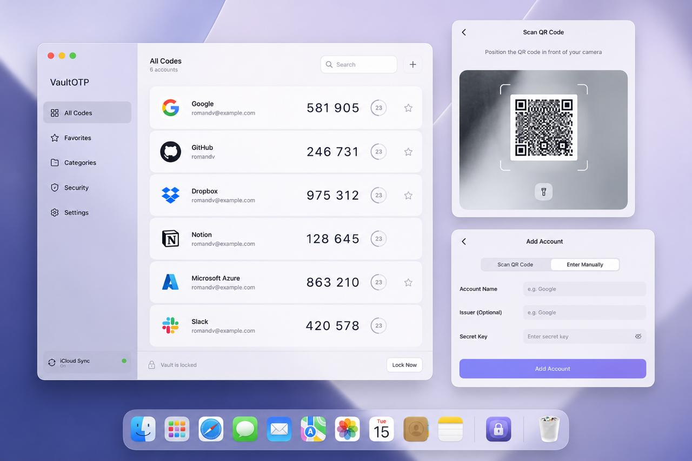

# AuthMyMac

<p align="center">
  
</p>

AuthMyMac is a local-only macOS authenticator for RFC 6238 time-based one-time
passwords (TOTP). Accounts stay on your Mac in the system Keychain. There is no
network account, telemetry, or secret synchronization in the base application.

<p align="center">
  
</p>

## Features

- Generate TOTP codes locally with a shared, visible countdown.
- Store account metadata and secrets in the macOS Keychain.
- Add accounts manually or scan provisioning QR codes with the camera.
- Scan a selected screen region for QR codes when a camera is not available.
- Import and export Google Authenticator migration payloads with confirmation.
- Search, favorite, edit, and remove accounts.
- Keep development and release Keychain namespaces separate.

## Requirements

- macOS 26 or newer
- Xcode 26 with the macOS 26 SDK
- Swift 6.2 or newer

## Install a release

Download the latest `AuthMyMac-*.zip` from the repository's [Releases] page,
unzip it, and move `AuthMyMac.app` to Applications. Release bundles are
ad-hoc signed development distributions; macOS may require confirmation in
Privacy & Security before the first launch. A Developer ID signed and
notarized distribution can be added later without changing the source build.

[Releases]: https://github.com/Romay777/AuthMyMac/releases

## Build, run, and test

Build the executable and run the complete test suite with Swift Package
Manager:

```sh
swift build
swift test
swift build -c release
```

To create an app bundle locally:

```sh
OPEN_AFTER_BUILD=0 ./BUILD.sh release
open dist/AuthMyMac.app
```

`BUILD.sh` accepts `MARKETING_VERSION` and `BUILD_NUMBER` environment variables
so CI artifacts carry the version from their release tag.

## Release tags and CI

Pushing a tag named `Release-X.Y` or `Release-X.Y.Z` runs
`.github/workflows/release.yml`. The workflow runs tests, builds the optimized
app bundle, packages it as `AuthMyMac-X.Y.zip` (or the matching three-part
version), and creates a GitHub Release with generated notes and the ZIP
attached.

For example:

```sh
git tag -a Release-1.0 -m "Release 1.0"
git push origin Release-1.0
```

## Project map

| Target | Responsibility |
| --- | --- |
| `App` | Composition root and macOS scenes |
| `Domain` | Dependency-free account metadata and security value types |
| `OTP` | Base32, HMAC, TOTP generation, and clock-skew verification |
| `Storage` | Local metadata, Keychain secrets, and transactional account store |
| `QR` | Provisioning URI and Google migration payload parsing/encoding |
| `CameraCapture` | Camera permission and capture-session lifecycle |
| `ScreenCapture` | Selection overlay and selected-region capture |
| `MenuBar` | Menu bar commands and lightweight presentation |
| `Notifications` | Authorization and local notification delivery |
| `UI` | Shared macOS views and design tokens |
| `Authenticator` | Cross-feature account workflows |
| `Diagnostics` | Privacy-constrained events, logging, and signposts |

See [Architecture](Docs/ARCHITECTURE.md), [Testing](Docs/TESTING.md), and
[Security](Docs/SECURITY.md) for implementation guidance.

## License

AuthMyMac is distributed under the [GNU General Public License v3.0](LICENSE).
